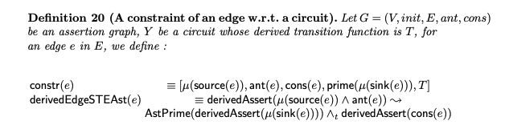
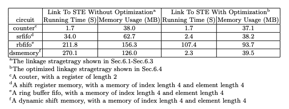

# A Linkage With GSTE At Boolean Level

We propose a new parameterized hardware verification algorithm through a term-level generalized symbolic trajectory evaluation. And this repo is an extension to our work, attempting to link our GSTE framework with the existing STE engine (Forte).


## How to run

1. We recommand you run this code in Fedora operating system, which is the suggested operation system by Forte.

2. Before starting, make sure Forte has been installed, verify the installation

   ```
   forte 
   ```

3. make sure python 3 has been installed, and install z3 solver

   ```
   pip install z3-solver
   ```

4. Download/Clone the GitHub repository into your Forte 

   ```
   https://github.com/LinkageWithGSTE/A-Linkage-With-GSTE-At-Boolean-Level.git
   ```

5. We verified four circuits in this repo and you can choose any of these four to run

   ```
   cd counter / cd dsmem / cd rbFIFO / cd rsFIFO 
   forte -noX -f run.fl
   ```

   

## The code structure

```
├── tools.fl            //Necessary Utils in specfication and assertion computation
├── trajEval.fl            //Encapsulation and Extension of origin Forte
├── invType.fl          //Encapsulation of inv concept in our GSTE framework
├── counter          //The first case study - counter
│   ├── circuit            //Verilog and Netlist of counter
│   │   ├── counter.blif            //Blif netlist
│   │   ├── counter.exe          //Model required by Forte
│   │   ├── counter.exlif           //Exlif netlist required by Forte
│   │   └── counter.v            //Initial verilog
│   ├── gen_sol.py            //Convert specification in GSTE to bit-level
│   ├── loadInv.fl            //Load the information in GSTE to Forte
│   ├── run.fl          //Run the verification without optimization
│   ├── run.sh          //Running shell
│   └── run_opt.fl            //Run the verification without optimization
├── rbFIFO              //The second case study - rbFIFO (structure same as above)
│   ├── circuit
│   │   ├── rbFIFO.blif
│   │   ├── rbFIFO.exe
│   │   ├── rbFIFO.exlif
│   │   └── rbFIFO.v
│   ├── gen_sol.py
│   ├── loadInv.fl
│   ├── run.fl
│   ├── run.sh
│   └── run_opt.fl
├── srFIFO              //The third case study - srFIFO (structure same as above)
│   ├── circuit
│   │   ├── srFIFO.blif
│   │   ├── srFIFO.exe
│   │   ├── srFIFO.exlif
│   │   └── srFIFO.v
│   ├── gen_sol.py
│   ├── loadInv.fl
│   ├── run.fl
│   ├── run.sh
│   └── run_opt.fl
├── dsmem               //The forth case study - dsmem (structure same as above)
│   ├── circuit
│   │   ├── dsmem.blif
│   │   ├── dsmem.exe
│   │   ├── dsmem.exlif
│   │   └── dsmem.v
│   ├── gen_sol.py
│   ├── loadInv.fl
│   ├── run.fl
│   ├── run.sh
│   └── run_opt.fl
└── yosysBlif2Exlif.py           //A tool to convert blif to exlif (required in Forte)
```


## A simple case study - counter

> Here, we will use counter as a case to illustrate how to make a linkage with GSTE at boolean level.

Counter is simple circuit with only one register. The verilog file is 

```verilog
module counter (clk, rst, en, count);

   input clk, rst, en;
   output reg [1:0] count;

   always @(posedge clk)
      if (rst)
         count <= 2'd0;
      else if (en)
         count <= count + 2'd1;

endmodule
```

In our GSTE framework, we will construct a bound GSTE assertion graph, which is the key point of verification.


The following steps are to make a linkage with GSTE at boolean level.

Let us focus on the green part in the above figure, which can be regarded as a term-level formula. In the first step, we can get all solutions of the term-level formula with the help of SMT solver, defined in <u>counter/gen_sol.py</u>. 

```
def all_smt(f, keys):
    res = []
    s = Solver()
    s.add(f)
    while sat == s.check():
        m = s.model()
        partial_model = [(k == m.eval(k)) for k in keys]
        subs = []
        res_t = []
        for k in keys:
            subs.append((k,m.eval(k)))
        for k in keys:
            value = str(m.eval(k))
            if value=="True" or value=="False":
            res_t.append("b %s %s" % (str(k), str(m.eval(k))))
            else:
            res_t.append("bv %s %s" % (str(k), str(m.eval(k))))
        res.append(res_t)
        s.add(Not(And(partial_model)))
    return res
```

The solution can be seen as an assignment with only three type variable, defined in invType.fl

* Boolean
* Bitvec
* Array

```
lettype invVar = 
      BOOLEAN string 
    | BITVEC string int
    | ARRAY string int int 
    ;

lettype invForm =
      boolIs invVar bexpr
    | bitvecIs invVar int 
    | arrayIs invVar  int string
;
```

The second step is to convert such solutions and other inforamtion in GSTE to the corresponding bit-level STE assertion. The bit-level STE assertion framework is defined as follows




The convertion code is as follows

```
//******ant******
letrec invform2trajform_ant (boolIs (BOOLEAN v) c) = 
        let node = v in 
        let var = bvariable v in 
        Isb var node 
    /\ invform2trajform_ant (bitvecIs (BITVEC v i) c) =
        let node = map (\i. v^"<"^(int2str i)^">") (0 upto (i-1)) in 
        let var = map (\i. bvariable (v^"<"^(int2str i)^">")) (0 upto (i-1)) in  
        node bvAre var
    /\ invform2trajform_ant (arrayIs (ARRAY v i1 i2) a c) = 
        let node adr = map (\d. v^"<"^(int2str adr)^">"^"<"^(int2str d)^">") (0 upto (i2-1)) in 
        let var adr  = map (\d. bvariable (v^"<"^(int2str adr)^">"^"<"^(int2str d)^">")) (0 upto (i2-1)) in
        let nodes = map3 (\i. node i) (0 upto (i1-1)) in 
        let vars = map3  (\i. var i) (0 upto (i1-1)) in 
        nodes bvAre vars 
;

letrec inv2trajform_ant [] = [Chaos]
    /\ inv2trajform_ant (x:xs) = (invform2trajform_ant x):(inv2trajform_ant xs) ;
//******consequence******
letrec invform2trajform_consequence (boolIs (BOOLEAN v) c) = 
        let node = v in 
        let var = bvariable (v^"_") in 
        Next (Isb var node )
    /\ invform2trajform_consequence (bitvecIs (BITVEC v i) c) =
        let node = map (\i. v^"<"^(int2str i)^">") (0 upto (i-1)) in 
        let var = map (\i. bvariable (v^"<"^(int2str i)^">_")) (0 upto (i-1)) in  
        Next (node bvAre var)
    /\ invform2trajform_consequence (arrayIs (ARRAY v i1 i2) a c) = 
        let node adr = map (\d. v^"<"^(int2str adr)^">"^"<"^(int2str d)^">") (0 upto (i2-1)) in 
        let var adr  = map (\d. bvariable (v^"<"^(int2str adr)^">"^"<"^(int2str d)^">_")) (0 upto (i2-1)) in
        let nodes = map3 (\i. node i) (0 upto (i1-1)) in 
        let vars = map3  (\i. var i) (0 upto (i1-1)) in 
        Next (nodes bvAre vars )
;

letrec inv2trajform_consequence [] = []
    /\ inv2trajform_consequence (x:xs) = (invform2trajform_consequence x):(inv2trajform_consequence xs) ;

//*****constraint*******
letrec invform2trajform_constraint_ant (boolIs (BOOLEAN v) c) = 
        ( c=bT =>  (bvariable v) | bNOT (bvariable v) )
    /\ invform2trajform_constraint_ant (bitvecIs (BITVEC v i) c) =
        let var = map (\i. bvariable (v^"<"^(int2str i)^">")) (0 upto (i-1)) in 
        var valIs c 
    /\ invform2trajform_constraint_ant (arrayIs (ARRAY v i1 i2) a c) =
        let var = map (\d. bvariable (v^"<"^(int2str a)^">"^"<"^(int2str d)^">")) (0 upto (i2-1)) in 
        let D = map (\d. bvariable (c^"<"^(int2str d)^">")) (0 upto (i2-1)) in 
        bEqs var D 
;

letrec inv2trajform_constraint_ant [] = bT
    /\ inv2trajform_constraint_ant  (x:xs) = (invform2trajform_constraint_ant x) bAND (inv2trajform_constraint_ant xs) ;
;

letrec invform2trajform_constraint_consequence (boolIs (BOOLEAN v) c) = 
        ( c=bT =>  (bvariable (v^"_")) | bNOT (bvariable (v^"_")) )
    /\ invform2trajform_constraint_consequence (bitvecIs (BITVEC v i) c) =
        let var = map (\i. bvariable (v^"<"^(int2str i)^">_")) (0 upto (i-1)) in 
        var valIs c 
    /\ invform2trajform_constraint_consequence (arrayIs (ARRAY v i1 i2) a c) =
        let var = map (\d. bvariable (v^"<"^(int2str a)^">"^"<"^(int2str d)^">_")) (0 upto (i2-1)) in 
        let D = map (\d. bvariable (c^"<"^(int2str d)^">")) (0 upto (i2-1)) in 
        bEqs var D 
;

letrec inv2trajform_constraint_consequence [] = bT
    /\ inv2trajform_constraint_consequence  (x:xs) = (invform2trajform_constraint_consequence x) bAND (inv2trajform_constraint_consequence xs) ;
;

```

Finally, we can run the STE engine as general Forte does, defined in counter/run.fl. 

Moreover, we make an optimization on the linkage, defined in counter/run_opt.fl.


### The experiment result of our four cases




